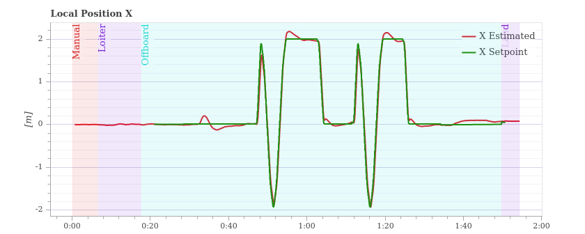
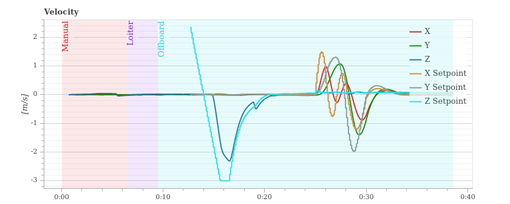

# PX4 Path Planner
Offboard/Onboard development for PX4 Autopilot with
1. **Autonomous navigation** with **Trajectory planning** 
2. **Added-But-Not-Using** cubic spline library from https://github.com/ttk592/spline/blob/master/src/spline.h (Includes first and second derivatives that can be use in sending to PX4, however currently only velocity is being used currently) 
```
Cubic spline library is not used and is replaced by a Custom Bspline Trajectory Generation, which is able to constrain agent path within control points 
```
3. **Added** CSV parser to C++ (https://github.com/ben-strasser/fast-cpp-csv-parser) this is used for passing waypoints in a certain format to generate the trajectory

4. **Included** Eigen3 library (`Vector3d` and `MatrixXd`)

5. Using `v1.12.3` of PX4-Autopilot, run with `make px4_sitl gazebo HEADLESS=1`

6. Launch with `roslaunch px4_path_planner main.launch`

- `trajectory_representation.ulg` has the full log for a test trajectory. This includes `takeoff`, `mission`, `home` and `landing`, which all uses the **Bspline** trajectory.

## Notes
0. Using Bspline Generic Recursive Representation by `K. Qin,General matrix representations forb-splines, Vis. Comput., 16 (2000),pp. 177–186.`

1. Example of a csv file format in text that can be found in `path/wp0.csv`.
```csv
xpos,ypos,zpos
0,0,5
0.2,0.8,5
1,0.5,5
1.5,1.0,5
0.5,0.5,5
0,0.0,5
```
**[Updated]** Trajectory generation has factored the `maximum velocity limits` into the calculation, hence `time` is taken out.

---
2. Do not use `~/` as home reference, as the `error` below will appear.
```bash
[trajectory.h] Trying to open ~/offb_ws/src/px4-path-planner/path/wp0.csv 
[trajectory.h] File not present!
```

---
3. The `yaml` common settings are below, there are `@brief` of the definitions in some of the code so you can have a look at them.
```yaml
# Command Parameters
setpoint_raw_mode: true

# Spline Parameters
spline_order: 5
control_points_division: 4
trajectory_pub_rate: 20

# Total number of Agents
unique_id_range: 20

# Agent Parameters
takeoff_height: 1.3
common_max_vel: 1.0
common_min_vel: 0.1
```

---
4. PX4 `master` branch does not allow offboard arming, which causes the drone to arm and disarm immediately, the code will keep forcing it and the request will be rejected. Hence use `v1.12.3` branch of `PX4-Autopilot`.
```git
HEAD detached at v1.12.3
```

---
5. Since this module would be used on lightweight platforms in GPS denied environments, we should add all the `# Other Addons` to the blacklist when launching `Mavros`
```yaml
plugin_blacklist:
# common
- safety_area
# extras
- image_pub
- vibration
- distance_sensor
- rangefinder
- wheel_odometry
# Other Addons
- landing_target
- px4flow
- vision_speed_estimate
- fake_gps
- global_position
- vfr_hud
- setpoint_attitude
- setpoint_accel
- setpoint_velocity
- mission
- rc_io
- param
- setpoint_trajectory
- gpsstatus
- debug_value
- adsb
- gps_rtk
- manual_control
- trajectory
- wind_estimation
- actuator_control
```

## Current Progress
0. Working for all tasks, and using `setpoint_raw` target of `position`, `velocity`, `acceleration` and `yaw`. `yaw` is mostly enabled during **mission** tasks only.

1. Tracking performance with spline provided, using `path/trajectory_representation.csv`
```
You can find the ulog file inside the media folder, media/trajectory_representation.ulg
```

| |  | 
|---|---|


| |  |
|---|---|

## References 
1. **Offboard Node Example** : https://docs.px4.io/master/en/ros/mavros_offboard.html
1. **Cubic Spline Library Reference - Not Used** : https://kluge.in-chemnitz.de/opensource/spline/